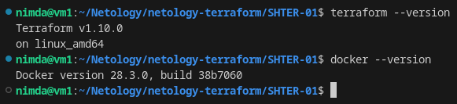
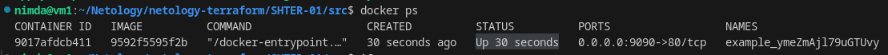
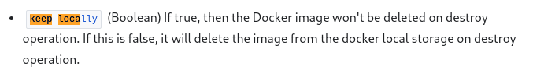

# Домашнее задание к занятию «Введение в Terraform» - `Горелов Николай`


## Задание 1

### 1. Установка Terraform и проверка версии

Установлена Terraform версии 1.10.0 и Docker версии 28.3.0:

```bash
$ terraform --version
$ docker --version
```



### 2. Изучение .gitignore

Согласно файлу `.gitignore`, личную секретную информацию можно сохранять в файл `personal.auto.tfvars`.

### 3. Выполнение кода проекта и поиск секретного содержимого

После выполнения `terraform apply` в state-файле найдено секретное содержимое ресурса `random_password`:

```json
{
  "version": 4,
  "terraform_version": "1.10.0",
  "serial": 1,
  "lineage": "7e4d79bc-8624-040a-f414-ca317695773e",
  "outputs": {},
  "resources": [
    {
      "mode": "managed",
      "type": "random_password",
      "name": "random_string",
      "provider": "provider[\"registry.terraform.io/hashicorp/random\"]",
      "instances": [
        {
          "schema_version": 3,
          "attributes": {
            "bcrypt_hash": "$2a$10$z0hVqcGmth/SWTPSxwYgr.jB0GuH.zxGaelAKRv5LYRadvEjnGN1C",
            "id": "none",
            "keepers": null,
            "length": 16,
            "lower": true,
            "min_lower": 1,
            "min_numeric": 1,
            "min_special": 0,
            "min_upper": 1,
            "number": true,
            "numeric": true,
            "override_special": null,
            "result": "ymeZmAjl79uGTUvy", # Секретный пароль
            "special": false,
            "upper": true
          },
          "sensitive_attributes": [
            [
              {
                "type": "get_attr",
                "value": "result"
              }
            ],
            [
              {
                "type": "get_attr",
                "value": "bcrypt_hash"
              }
            ]
          ]
        }
      ]
    }
  ],
  "check_results": null
}
```

Ключ: `result`, значение: `ymeZmAjl79uGTUvy`.

### 4. Раскомментирование блока кода и исправление ошибок

После раскомментирования блока кода в `main.tf` и выполнения `terraform validate` обнаружены ошибки:

1. Отсутствует обязательный параметр `name` для ресурса `docker_image`.
2. Некорректное использование параметров в ресурсе `docker_container`.

Исправленный фрагмент кода:

```hcl
resource "docker_image" "nginx" {
  name         = "nginx:latest"
  keep_locally = true
}

resource "docker_container" "nginx" {
  name  = "example_${random_password.random_string.result}"
  image = docker_image.nginx.name
  ports {
    internal = 80
    external = 9090
  }
}
```

### 5. Выполнение исправленного кода и вывод команды

Вывод команды `docker ps` после исправления:



### 6. Замена имени контейнера и использование `-auto-approve`

После замены имени контейнера на `hello_world` и выполнения `terraform apply -auto-approve`:

Опасность использования `-auto-approve`:
- Ключ автоматически подтверждает все изменения без запроса подтверждения, что может привести к нежелательным изменениям в инфраструктуре.
- Полезен для автоматизации в CI/CD пайплайнах, где интерактивное подтверждение невозможно.

Вывод команды `docker ps`:

```bash
CONTAINER ID   IMAGE          COMMAND                  CREATED         STATUS         PORTS                  NAMES
def456abc123   nginx:latest   "/docker-entrypoint.…"   1 minute ago   Up 1 minute   0.0.0.0:9090->80/tcp   hello_world_ymeZmAjl79uGTUvy
```

### 7. Уничтожение ресурсов и проверка `terraform.tfstate`

После выполнения `terraform destroy` содержимое файла `terraform.tfstate`:

```json
{
  "version": 4,
  "terraform_version": "1.10.0",
  "serial": 24,
  "lineage": "7e4d79bc-8624-040a-f414-ca317695773e",
  "outputs": {},
  "resources": [],
  "check_results": null
}
```

### 8. Почему не удалился docker-образ nginx:latest

Образ не удаляется, потому что в ресурсе `docker_image` установлен параметр `keep_locally = true`:

```hcl
resource "docker_image" "nginx" {
  name         = "nginx:latest"
  keep_locally = true  # Этот параметр предотвращает удаление образа при уничтожении ресурса
}
```

Подтверждение из документации Terraform провайдера docker:



---

## Задание 2*

---

## Задание 3*

### Установка OpenTofu (альтернативы Terraform)

OpenTofu - это форк Terraform с открытой лицензией (Mozilla Public License 2.0), созданный после изменения лицензирования HashiCorp.

Возьму инструкцию установки с сайта разработчика. [opentofu install on debian](https://opentofu.org/docs/intro/install/deb/)

Step-by-step instructions

The following steps explain how to set up the OpenTofu Debian repositories. These instructions should work on most Debian-based Linux systems.

Installing tooling
In order to add the repositories, you will need to install some tooling. On most Debian-based operating systems, these tools will already be installed.

```bash
sudo apt-get update
sudo apt-get install -y apt-transport-https ca-certificates curl gnupg
Set up the OpenTofu repository
First, you need to make sure you have a copy of the OpenTofu GPG key. This verifies that your packages have indeed been created using the official pipeline and have not been tampered with.
```

```bash
sudo install -m 0755 -d /etc/apt/keyrings
curl -fsSL https://get.opentofu.org/opentofu.gpg | sudo tee /etc/apt/keyrings/opentofu.gpg >/dev/null
curl -fsSL https://packages.opentofu.org/opentofu/tofu/gpgkey | sudo gpg --no-tty --batch --dearmor -o /etc/apt/keyrings/opentofu-repo.gpg >/dev/null
sudo chmod a+r /etc/apt/keyrings/opentofu.gpg /etc/apt/keyrings/opentofu-repo.gpg
```

Now you have to create the OpenTofu source list.

```bash
echo \
  "deb [signed-by=/etc/apt/keyrings/opentofu.gpg,/etc/apt/keyrings/opentofu-repo.gpg] https://packages.opentofu.org/opentofu/tofu/any/ any main
deb-src [signed-by=/etc/apt/keyrings/opentofu.gpg,/etc/apt/keyrings/opentofu-repo.gpg] https://packages.opentofu.org/opentofu/tofu/any/ any main" | \
  sudo tee /etc/apt/sources.list.d/opentofu.list > /dev/null
sudo chmod a+r /etc/apt/sources.list.d/opentofu.list
```

Installing OpenTofu
Finally, you can install OpenTofu:

```bash
sudo apt-get update
sudo apt-get install -y tofu
```

### Проверка установки

После установки проверяем версию:
```bash
tofu --version
```
Вывод команды:

```
OpenTofu v1.10.2
```

### Регистры провайдеров tofu для России

Разработчики закрыли доступ к регистрам провайдеров для ip-адресов из России.
Yandex предоставляет зеркало Terraform-провайдеров, которое работает в России.
Надо добавить настройку в ~/.terraformrc или ~/.tofurc:

```
provider_installation {
  network_mirror {
    url = "https://terraform-mirror.yandexcloud.net/"
    include = ["registry.opentofu.org/*/*"]
  }
  direct {
    exclude = ["registry.opentofu.org/*/*"]
  }
}
```

### Использование OpenTofu

OpenTofu поддерживает все основные функции Terraform и совместим с существующими конфигурациями.

Команды аналогичны Terraform:
```bash
tofu init
tofu plan
tofu apply
tofu destroy
```

### Выполнение кода с OpenTofu

Код успешно выполнен с помощью `tofu apply`. Различий в работе по сравнению с Terraform не обнаружено.

---