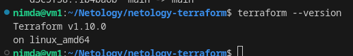
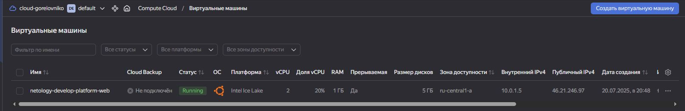
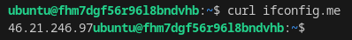
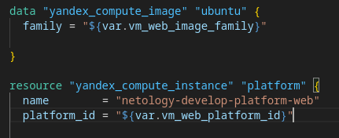
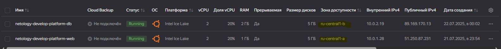
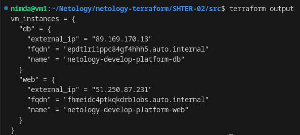
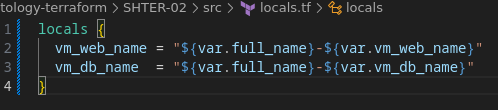
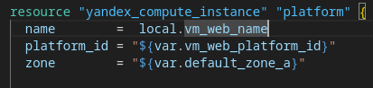

# Домашнее задание к занятию «Основы Terraform. Yandex Cloud» - `Горелов Николай`


### Задание 1




5. Исправил синтаксические ошибки в коде:
   Файл variables.tf:
   - Неправильное имя переменной `vms_ssh_root_key` вместо `vms_ssh_public_root_key`.
   Файл main.tf:
   - 19 строка: standart-v4 исправлено на standard-v3, потому что такой версии не существует и слово написано неправильно.
   - 22 строка: значение cores должно быть равно, только четным числам.
   - 24 строка: У core_fraction допустимые значения 20, 50, 100 при данной platform_id.
   - 41 строка: Неправильное имя переменной vms_ssh_public_root_key.




- Параметр `preemptible = true` позволяет создавать прерываемые ВМ, которые дешевле, но могут быть остановлены Yandex Cloud в любой момент. Полезен для тестовых сред.
- Параметр `core_fraction=20` ограничивает использование CPU до 20% от выделенного ядра, что снижает стоимость ВМ. Полезен для малозагруженных сервисов.

---

### Задание 2

Добавлено в variables.tf:

```hcl
variable "vm_web_image_family" {
  type    = string
  default = "ubuntu-2004-lts"
}

variable "vm_web_platform_id" {
  type    = string
  default = "standard-v3"
}
```

В main.tf также сделаны соответствующие изменения:
  

Terraform plan не выявил никаких изменений:


---

### Задание 3



---

### Задание 4



---

### Задание 5




---

### Задание 6


---

### Задание 7*

---

### Задание 8*

---

### Задание 9*

---