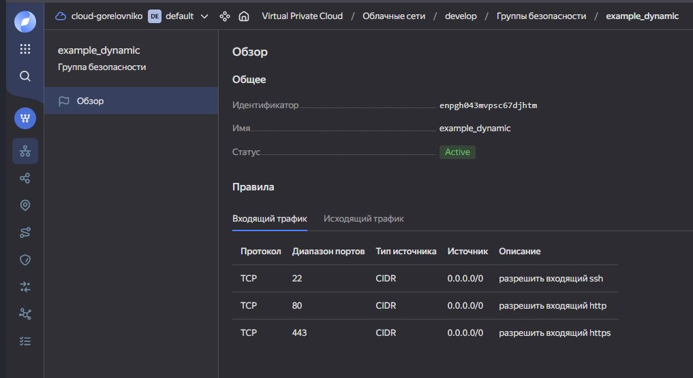

# Домашнее задание к занятию «Управляющие конструкции в коде Terraform» - `Горелов Николай`

### Задание 1

---

### Задание 2

[count-vm.tf](src/count-vm.tf)
[for_each-vm.tf](src/for_each-vm.tf)

---

### Задание 3

[disk_vm.tf](src/disk_vm.tf)

---

### Задание 4

[ansible.tf](src/ansible.tf)
[шаблон inventory.ini](src/templates/hosts.tftpl)

Не нашел такого файла [**demonstration2**](https://github.com/netology-code/ter-homeworks/tree/main/03/demo)

[Динамический inventory.ini](src/)

---

### Задание 5*

---

### Задание 6*

---

### Задание 7*

---

### Задание 8*

---

### Задание 9*

---
